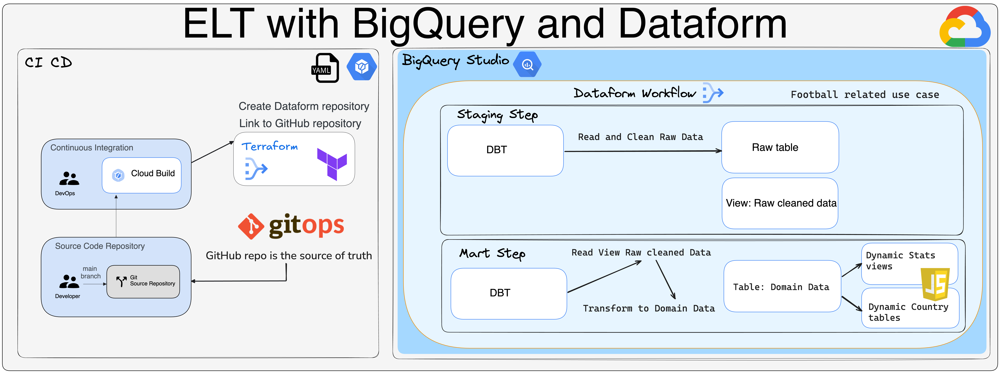

# world-cup-qatar-elt-dataform

This repo shows a real world use case with Dataform, BigQuery and Google Cloud. 
The raw and input data are represented by the Qatar Fifa World Cup Players stats, 
some transformations are applied with the ELT pattern and DBT to apply aggregation and business transformations.



## Create the Dataform repository with Terraform and synchronize with a GitHub repository

The SSH public host key value must be in the format of a known_hosts file. The value must contain an algorithm and a public key encoded in the base64 format, but without the hostname or IP, in the following format:

The GitHub host public key corresponds to this format.

Retrieve GitHub host public key:

```bash
ssh-keyscan -t rsa github.com
```

Plan:

```bash
gcloud builds submit \
    --project=$PROJECT_ID \
    --region=$LOCATION \
    --config create-dataform-repo-terraform-plan.yaml \
    --substitutions _TF_STATE_BUCKET=$TF_STATE_BUCKET,_TF_STATE_PREFIX=$TF_STATE_PREFIX,_DATAFORM_REPO_NAME=$DATAFORM_REPO_NAME,_DATAFORM_SA=$DATAFORM_SA \
    --verbosity="debug" .
```

Apply:

```bash
gcloud builds submit \
    --project=$PROJECT_ID \
    --region=$LOCATION \
    --config create-dataform-repo-terraform-apply.yaml \
    --substitutions _TF_STATE_BUCKET=$TF_STATE_BUCKET,_TF_STATE_PREFIX=$TF_STATE_PREFIX,_DATAFORM_REPO_NAME=$DATAFORM_REPO_NAME,_DATAFORM_SA=$DATAFORM_SA \
    --verbosity="debug" .
```